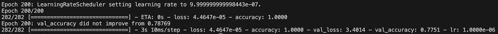

## Quick Start for Recipients

### Recommended: Native Installation (GUI + OBS Virtual Camera)

This is the recommended approach for running the live engagement detection with GUI dashboard and OBS Virtual Camera access.

**Windows:**
```cmd
setup.bat
```
See [SETUP_WINDOWS.md](SETUP_WINDOWS.md) for detailed instructions.

**macOS/Linux:**
```bash
chmod +x setup.sh
./setup.sh
```
See [SETUP_MACOS.md](SETUP_MACOS.md) for detailed instructions.

**What the setup does:**
1. Uses Docker to build an image with all Python dependencies
2. Extracts Python packages from Docker to a local virtual environment
3. Installs system dependencies (ffmpeg, etc.) natively
4. Sets up everything needed to run the script

**Requirements:**
- Docker Desktop (must be running)
- Python 3.10+
- OBS Studio (for Virtual Camera)

**After setup:**
1. Activate the virtual environment (see platform-specific guide)
2. Set up OBS Studio and start Virtual Camera (see platform-specific guide for detailed OBS setup instructions)
3. Run: `python live_marlin_openface_combination.py`

You'll see a GUI window with live engagement predictions.

**Note:** If you've never used OBS Studio before, see the "Setting Up OBS Studio" section in your platform-specific guide (SETUP_WINDOWS.md or SETUP_MACOS.md) for step-by-step instructions.


## Docker

### For Package Installation (Setup)

The Docker setup is primarily used to install dependencies:

```bash
docker compose -f docker-compose.setup.yml up --build
```

This builds the Docker image and extracts Python packages to your local `venv/` directory. This is handled automatically by the setup scripts (`setup.sh` or `setup.bat`).

### Building the Docker Image

If you need to build the Docker image manually:

```bash
docker build -t engagenet:cpu .
```

**Environment variables (override as needed):**

```
MARLIN_MODEL_PATH=/app/models/marlin/marlin_vit_base_ytf.encoder.pt
CHECKPOINT_PATH=/app/checkpoints/fusion_best.keras
MARLIN_DIR=/app/data/marlin_embeddings
OPENFACE_DIR=/app/data/openface_output
LABELS_CSV=/app/data/final_labels.csv
```

**Required model files:**

```
models/marlin/marlin_vit_base_ytf.encoder.pt
checkpoints/fusion_best.keras
```

## Platform-Specific Guides

- **Windows:** See [SETUP_WINDOWS.md](SETUP_WINDOWS.md) for complete Windows setup instructions
- **macOS:** See [SETUP_MACOS.md](SETUP_MACOS.md) for complete macOS setup instructions
- **Distribution:** See [DISTRIBUTION.md](DISTRIBUTION.md) if you need to share this project with others


## For Distribution

If you're sharing this project with others, see [DISTRIBUTION.md](DISTRIBUTION.md) for:
- What files to include
- How to package the project
- Prerequisites for recipients
- Testing checklist

## Results

We trained **EngageNet** on the DAiSEE dataset and achieved:

- **Validation Accuracy**: 80% stored (77.51% in random test run)

<p align="center">
  
</p>

## Additional Resources

- Live demo video: https://drive.google.com/drive/folders/1zaw-QntnvuwWmHRhLo98DzCJSy2f4hSe?dmr=1&ec=wgc-drive-hero-goto